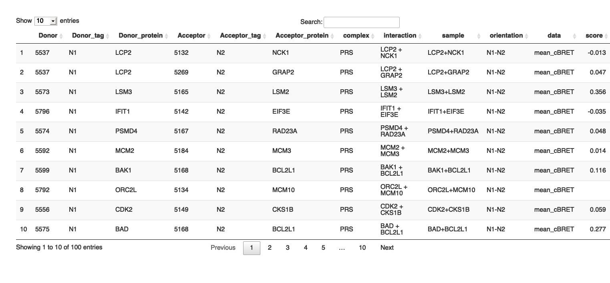

<!-- README.md is generated from README.Rmd. Please edit that file -->

# binaryPPIclassifier

<!-- badges: start -->

[](https://lifecycle.r-lib.org/articles/stages.html#experimental)

<!-- badges: end -->

The binaryPPIclassifier package uses machine learning algorithms to
prioritize protein-protein interactions (PPIs) by analyzing quantitative
data from binary PPI assays and AlphaFold-Multimer predictions.

## Installation

You can install the development version of binaryPPIclassifier from
[GitHub](https://github.com/) with:

``` r
# install.packages("devtools")
devtools::install_github("philipptrepte/binary-PPI-classifier", build_vignettes = TRUE)

library(binaryPPIclassifier)
```

## Requirements

The reference set used for training the machine learning algorithm and
the PPI data frame that it is applied to needs to have the following
format and columns names:



## Usage

### ppi.prediction()

The function `ppi.prediction()` is used to train a classifier machine
learning algorithms on a set of reference interactions `referenceSet`
and apply it to a test set PPI data set `PPIdf`. Please see
`?ppi.prediction` for help on additional parameters that need to be
specified.

``` r
YOUR_PREDICTION <- ppi.prediction(PPIdf = YOUR_TEST_SET, referenceSet = YOUR_TRAINING_SET)
```

### learning.curve()

The function `learning.curve()` is used to calculate and plot the
accuracy, hinge loss and binary cross-entropy loss from the results of
your `ppi.prediction()` result. Please see `?learning.curve` for help on
additional parameters that can to be specified.

``` r
YOUR_LEARNING_CURVE <- learning.curve(ppi_prediction_result = YOUR_PREDICTION) 
```

The results are saved in a list and the plot can be accessed using
`YOUR_LEARNING_CURVE$learning_plot`

### recovery.rate()

The function `recovery.rate()` is used to determine fixed cut-offs using
a set of reference interactions `referenceSet` that can be applied to a
PPI data set `PPIdf` (optional) and the recovery rates are calculated
for both data sets. Please see `?recovery.rate` for help on additional
parameters that can to be specified.

``` r
YOUR_RECOVERY_RATE <- recovery.rate(PPIdf = YOUR_TEST_SET, referenceSet = YOUR_TRAINING_SET)
```

## Vignette

Please see the Vignette for a detailed description using
`vignette("introduction", package = "binaryPPIclassifier")`. Make sure
that when installing the package you set `build_vignettes = TRUE`.

## Reference

<u>**AI-guided pipeline for protein-protein interaction drug discovery
identifies a SARS-CoV-2 inhibitor**</u>

Philipp Trepte#, Christopher Secker#, Simona Kostova, Sibusiso
B. Maseko, Soon Gang Choi, Jeremy Blavier, Igor Minia, Eduardo,
Silva Ramos, Patricia Cassonnet, Sabrina Golusik, Martina Zenkner, Stephanie Beetz, Mara
J. Liebich, Nadine Scharek, Anja Schütz, MarcelSperling, Michael Lisurek, Yang Wang, Kerstin Spirohn, Tong Hao, Michael
A. Calderwood, David
E. Hill, Markus Landthaler, Julien Olivet, Jean-Claude Twizere, Marc Vidal, Erich
E. Wanker

bioRxiv 2023.06.14.544560; doi: <https://doi.org/10.1101/2023.06.14.544560>

## License

Distributed under the MIT License. See `License.md` for more
information.

## Contact

Philipp Trepte - <philipp.trepte@imba.oeaw.ac.at> -
[LinkedIn](https://www.linkedin.com/in/philipp-trepte/)

binaryPPIclassifier: <https://github.com/philipptrepte/binary-PPI-classifier>

## Session Info

``` r
sessionInfo()
#> R version 4.2.1 (2022-06-23)
#> Platform: x86_64-apple-darwin17.0 (64-bit)
#> Running under: macOS Big Sur ... 10.16
#> 
#> Matrix products: default
#> BLAS:   /Library/Frameworks/R.framework/Versions/4.2/Resources/lib/libRblas.0.dylib
#> LAPACK: /Library/Frameworks/R.framework/Versions/4.2/Resources/lib/libRlapack.dylib
#> 
#> locale:
#> [1] en_US.UTF-8/en_US.UTF-8/en_US.UTF-8/C/en_US.UTF-8/en_US.UTF-8
#> 
#> attached base packages:
#> [1] stats     graphics  grDevices utils     datasets  methods   base     
#> 
#> other attached packages:
#> [1] knitr_1.40  dplyr_1.1.2 DT_0.24    
#> 
#> loaded via a namespace (and not attached):
#>  [1] pillar_1.9.0      compiler_4.2.1    bslib_0.4.0       jquerylib_0.1.4  
#>  [5] highr_0.9         tools_4.2.1       digest_0.6.29     jsonlite_1.8.0   
#>  [9] evaluate_0.16     lifecycle_1.0.3   tibble_3.2.1      pkgconfig_2.0.3  
#> [13] rlang_1.1.1       cli_3.6.1         rstudioapi_0.14   crosstalk_1.2.0  
#> [17] yaml_2.3.5        xfun_0.32         fastmap_1.1.0     stringr_1.4.1    
#> [21] generics_0.1.3    vctrs_0.6.3       htmlwidgets_1.5.4 sass_0.4.2       
#> [25] webshot_0.5.3     tidyselect_1.2.0  glue_1.6.2        R6_2.5.1         
#> [29] processx_3.7.0    fansi_1.0.3       rmarkdown_2.16    callr_3.7.2      
#> [33] magrittr_2.0.3    ps_1.7.1          htmltools_0.5.3   utf8_1.2.2       
#> [37] stringi_1.7.8     cachem_1.0.6
```
