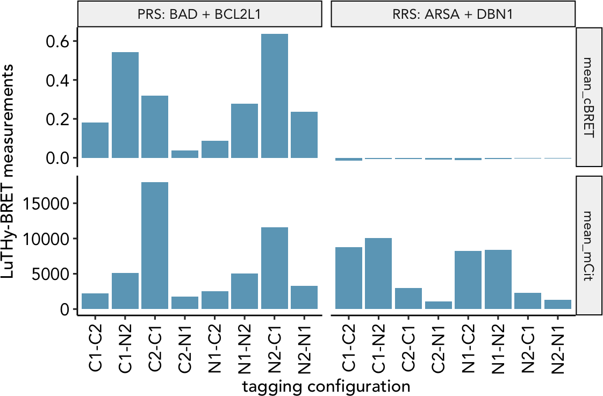
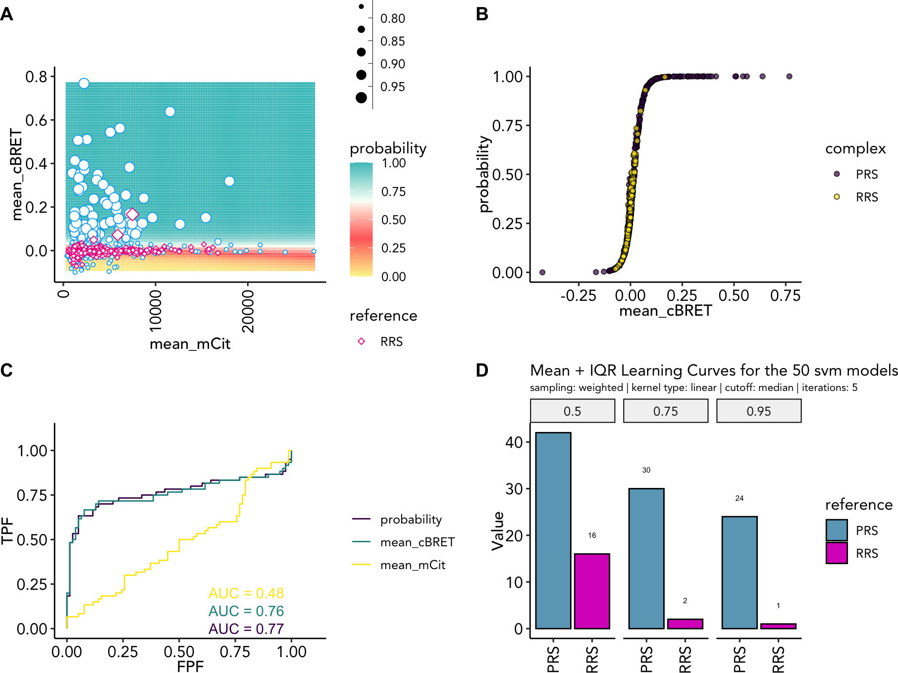
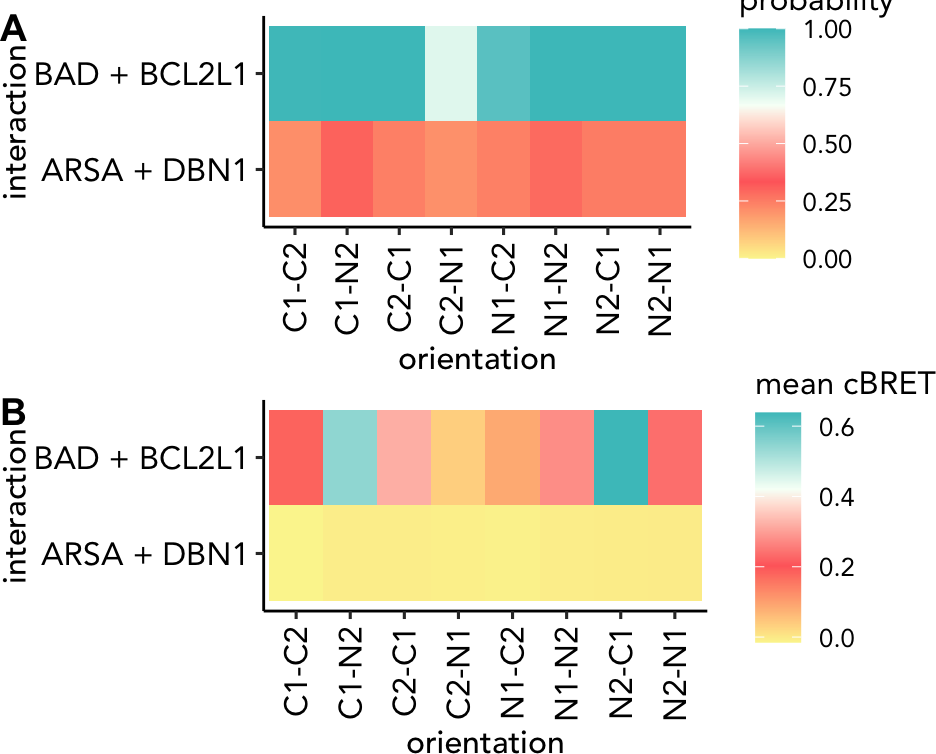
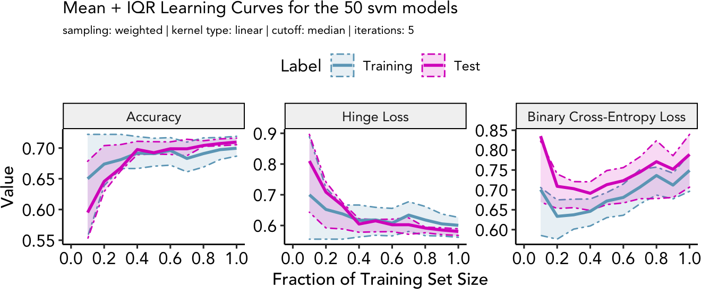

\pagebreak

# Using machine learning (ML) algorithms to classify quantitative PPI results

This vignette gives an introduction to the `binaryPPIclassifier` package. A **support vector machine learning** or **random forest** algorithm in combination with multi-adaptive sampling is trained on a data set containing positive and random/negative reference protein-protein interaction (PPI) results. The generated models are then applied to a set of PPIs with unknown classification and their likelihood to be positive or negative is predicted.

# Installation

You can install the development version of binaryPPIclassifier from [GitHub](https://github.com/) with:

``` r
# install.packages("devtools")
devtools::install_github("philipptrepte/binary-PPI-classifier")

library(binaryPPIclassifier)
```

# Requirements

The input data should have been pre-processed or tidied if necessary.

## Example dataset: LuTHy results from PRS-v2 and RRS-v2

We used the LuTHy assay ([Trepte et al. Mol Sys Biol 2018](https://www.embopress.org/doi/full/10.15252/msb.20178071)) to detect protein-protein interactions between 60 PRS-v2 and 78 RRS-v2 ([Choi et al. Nat Com 2019](https://www.nature.com/articles/s41467-019-11809-2)), which were each tested in 8 tagging configutation with the LuTHy-BRET and LuTHy-LuC assay versions ([Trepte & Secker et al. bioRxiv 2023](https://www.biorxiv.org/content/10.1101/2023.06.14.544560v1)).

The dataset contains *in-cell* LuTHy-BRET and *cell-free* LuTHy-LuC measurements. For the LuTHy-BRET we measure the Acceptor protein expression *mean_mCit*, which directly influences the BRET ratio *mean_cBRET*. For the LuTHy-LuC, we measure the raw luminescence value after precipitation *mean_LumiOUT* of the Donor protein which is normalized to its expression resulting in the *mean_cLuC*.

For more details on the LuTHy assay and its measurement parameters, please read:

1.  Trepte, P. *et al.* LuTHy: a double-readout bioluminescence-based two-hybrid technology for quantitative mapping of protein--protein interactions in mammalian cells. *Mol Syst Biol* **14**, e8071 (2018). [[Link](https://www.embopress.org/doi/full/10.15252/msb.20178071)]

2.  Trepte, P. & Secker, C. *et al.* AI-guided pipeline for protein-protein interaction drug discovery identifies a SARS-CoV-2 inhibitor. *bioRxiv* 2023.06.14.544560 (2023) <doi:10.1101/2023.06.14.544560>. [[Link](https://www.biorxiv.org/content/10.1101/2023.06.14.544560v1)]

## Loading of the data


```r
data("luthy_reference_sets")
```


Table: (\#tab:inputTable)Input table showing results for the interaction BAD + BCL2L1 from `luthy_reference_sets`.

|Donor |Donor_tag |Donor_protein |Acceptor |Acceptor_tag |Acceptor_protein |complex |interaction  |sample     |orientation |data         |        score|
|:-----|:---------|:-------------|:--------|:------------|:----------------|:-------|:------------|:----------|:-----------|:------------|------------:|
|5575  |N1        |BAD           |5168     |N2           |BCL2L1           |PRS     |BAD + BCL2L1 |BAD+BCL2L1 |N1-N2       |mean_LumiOUT | 2.984230e+05|
|5575  |N1        |BAD           |5431     |C2           |BCL2L1           |PRS     |BAD + BCL2L1 |BAD+BCL2L1 |N1-C2       |mean_LumiOUT | 6.519733e+04|
|5838  |C1        |BAD           |5168     |N2           |BCL2L1           |PRS     |BAD + BCL2L1 |BAD+BCL2L1 |C1-N2       |mean_LumiOUT | 4.999130e+05|
|5838  |C1        |BAD           |5431     |C2           |BCL2L1           |PRS     |BAD + BCL2L1 |BAD+BCL2L1 |C1-C2       |mean_LumiOUT | 7.323867e+04|
|5694  |N2        |BCL2L1        |5049     |N1           |BAD              |PRS     |BAD + BCL2L1 |BCL2L1+BAD |N2-N1       |mean_LumiOUT | 4.725640e+05|
|5957  |C2        |BCL2L1        |5049     |N1           |BAD              |PRS     |BAD + BCL2L1 |BCL2L1+BAD |C2-N1       |mean_LumiOUT | 3.265000e+04|
|5694  |N2        |BCL2L1        |5312     |C1           |BAD              |PRS     |BAD + BCL2L1 |BCL2L1+BAD |N2-C1       |mean_LumiOUT | 2.395853e+06|
|5957  |C2        |BCL2L1        |5312     |C1           |BAD              |PRS     |BAD + BCL2L1 |BCL2L1+BAD |C2-C1       |mean_LumiOUT | 9.105850e+04|
|5575  |N1        |BAD           |5168     |N2           |BCL2L1           |PRS     |BAD + BCL2L1 |BAD+BCL2L1 |N1-N2       |mean_mCit    | 5.011334e+03|
|5575  |N1        |BAD           |5431     |C2           |BCL2L1           |PRS     |BAD + BCL2L1 |BAD+BCL2L1 |N1-C2       |mean_mCit    | 2.547251e+03|
|5838  |C1        |BAD           |5168     |N2           |BCL2L1           |PRS     |BAD + BCL2L1 |BAD+BCL2L1 |C1-N2       |mean_mCit    | 5.091001e+03|
|5838  |C1        |BAD           |5431     |C2           |BCL2L1           |PRS     |BAD + BCL2L1 |BAD+BCL2L1 |C1-C2       |mean_mCit    | 2.249626e+03|
|5694  |N2        |BCL2L1        |5049     |N1           |BAD              |PRS     |BAD + BCL2L1 |BCL2L1+BAD |N2-N1       |mean_mCit    | 3.293543e+03|
|5957  |C2        |BCL2L1        |5049     |N1           |BAD              |PRS     |BAD + BCL2L1 |BCL2L1+BAD |C2-N1       |mean_mCit    | 1.744793e+03|
|5694  |N2        |BCL2L1        |5312     |C1           |BAD              |PRS     |BAD + BCL2L1 |BCL2L1+BAD |N2-C1       |mean_mCit    | 1.157221e+04|
|5957  |C2        |BCL2L1        |5312     |C1           |BAD              |PRS     |BAD + BCL2L1 |BCL2L1+BAD |C2-C1       |mean_mCit    | 1.801200e+04|
|5575  |N1        |BAD           |5168     |N2           |BCL2L1           |PRS     |BAD + BCL2L1 |BAD+BCL2L1 |N1-N2       |mean_cBRET   | 2.765355e-01|
|5575  |N1        |BAD           |5431     |C2           |BCL2L1           |PRS     |BAD + BCL2L1 |BAD+BCL2L1 |N1-C2       |mean_cBRET   | 8.709540e-02|
|5838  |C1        |BAD           |5168     |N2           |BCL2L1           |PRS     |BAD + BCL2L1 |BAD+BCL2L1 |C1-N2       |mean_cBRET   | 5.438252e-01|
|5838  |C1        |BAD           |5431     |C2           |BCL2L1           |PRS     |BAD + BCL2L1 |BAD+BCL2L1 |C1-C2       |mean_cBRET   | 1.808837e-01|
|5694  |N2        |BCL2L1        |5049     |N1           |BAD              |PRS     |BAD + BCL2L1 |BCL2L1+BAD |N2-N1       |mean_cBRET   | 2.366357e-01|
|5957  |C2        |BCL2L1        |5049     |N1           |BAD              |PRS     |BAD + BCL2L1 |BCL2L1+BAD |C2-N1       |mean_cBRET   | 3.644020e-02|
|5694  |N2        |BCL2L1        |5312     |C1           |BAD              |PRS     |BAD + BCL2L1 |BCL2L1+BAD |N2-C1       |mean_cBRET   | 6.381235e-01|
|5957  |C2        |BCL2L1        |5312     |C1           |BAD              |PRS     |BAD + BCL2L1 |BCL2L1+BAD |C2-C1       |mean_cBRET   | 3.185715e-01|
|5575  |N1        |BAD           |5168     |N2           |BCL2L1           |PRS     |BAD + BCL2L1 |BAD+BCL2L1 |N1-N2       |mean_cLuC    | 7.362038e-01|
|5575  |N1        |BAD           |5431     |C2           |BCL2L1           |PRS     |BAD + BCL2L1 |BAD+BCL2L1 |N1-C2       |mean_cLuC    | 6.521600e-01|
|5838  |C1        |BAD           |5168     |N2           |BCL2L1           |PRS     |BAD + BCL2L1 |BAD+BCL2L1 |C1-N2       |mean_cLuC    | 1.001871e+00|
|5838  |C1        |BAD           |5431     |C2           |BCL2L1           |PRS     |BAD + BCL2L1 |BAD+BCL2L1 |C1-C2       |mean_cLuC    | 7.442408e-01|
|5694  |N2        |BCL2L1        |5049     |N1           |BAD              |PRS     |BAD + BCL2L1 |BCL2L1+BAD |N2-N1       |mean_cLuC    | 1.196843e+00|
|5957  |C2        |BCL2L1        |5049     |N1           |BAD              |PRS     |BAD + BCL2L1 |BCL2L1+BAD |C2-N1       |mean_cLuC    | 5.047924e-01|
|5694  |N2        |BCL2L1        |5312     |C1           |BAD              |PRS     |BAD + BCL2L1 |BCL2L1+BAD |N2-C1       |mean_cLuC    | 2.608016e+00|
|5957  |C2        |BCL2L1        |5312     |C1           |BAD              |PRS     |BAD + BCL2L1 |BCL2L1+BAD |C2-C1       |mean_cLuC    | 1.114725e-01|

------------------------------------------------------------------------

| Column name      | Description                                                                                                                                                                                   |
|-------------|-----------------------------------------------------------|
| Donor            | unique id to identify the donor construct                                                                                                                                                     |
| Donor_tag        | indicates if the donor protein is tagged N-terminally ("**N**") or C-terminally ("**C**")                                                                                                     |
| Donor_protein    | a protein identifier, e.g. BCL2L1                                                                                                                                                             |
| Acceptor         | unique id to identify the acceptor construct                                                                                                                                                  |
| Acceptor_tag     | indicates if the acceptor protein is tagged N-terminally ("**N**") or C-terminally ("**C**")                                                                                                  |
| Acceptor_protein | a protein identifier, e.g. BAD                                                                                                                                                                |
| complex          | should contain information if it is a reference interaction (e.g. "PRS"/"RRS") or if it is part of any other known complex (e.g. "LAMTOR")                                                    |
| interaction      | should indicate the tested interaction independent on the tagging configuration, e.g. "BAD + BCL2L1"                                                                                          |
| sample           | should indicate the tested interaction dependent on the tagging configuration, e.g. "BCL2L1 + BCL2L1"                                                                                         |
| orientation      | indicates the exact tagging orientation of the first indicated donor protein (e.g. N1) and the second indicated acceptor protein (e.g. N2): N1-N2 for BAD + BCL2L1 and N2-N1 for BCL2L1 + BAD |
| data             | indicates the type of data measured for an indicated interaction, e.g. "mean_cBRET" or "mean_cLuC"                                                                                            |
| score            | The corresponding data value                                                                                                                                                                  |

: (#tab:reqCol) Required table columns. Additional metadata columns are optional, e.g. UniProt ids

## Example interaction: BAD + BCL2L1

| Tagging configuration (`orientation` column) | Example (NL = NanoLuc; mCit = mCitrine) | interaction  | sample       |
|------------------------|---------------------|--------------|--------------|
| C1-C2                                        | BAD-NL + BCL2L1-mCit                    | BAD + BCL2L1 | BAD + BCL2L1 |
| C1-N2                                        | BAD-NL + mCit-BCL2L1                    | BAD + BCL2L1 | BAD + BCL2L1 |
| N1-C2                                        | NL-BAD + BCL2L1-mCit                    | BAD + BCL2L1 | BAD + BCL2L1 |
| N1-N2                                        | NL-BAD + mCit-BCL2L1                    | BAD + BCL2L1 | BAD + BCL2L1 |
| C2-C1                                        | BCL2L1-NL + BAD-mCit                    | BAD + BCL2L1 | BCL2L1 + BAD |
| C2-N1                                        | BCL2L1-NL + mCit-BAD                    | BAD + BCL2L1 | BCL2L1 + BAD |
| N2-C1                                        | NL-BCL2L1 + BAD-mCit                    | BAD + BCL2L1 | BCL2L1 + BAD |
| N2-N1                                        | NL-BCL2L1 + mCit-BAD                    | BAD + BCL2L1 | BCL2L1 + BAD |

: (#tab:TableTaggingOrientation) Tagging configurations and formatting of interaction and sample column.

### LuTHy-BRET

<div class="figure">

<p class="caption">(\#fig:luthyBretExample)LuTHy-BRET results for one positive (BAD + BCL2L1) and one random (ARSA + DBN1) PPI</p>
</div>

# Usage

The ML algorithms for the LuTHy-BRET and LuTHy-LuC are trained on the *mean_cBRET* and *mean_mCit* or *mean_cLuC* and *mean_LumiOUT* features, respectively. Other assays that provide only one quantitative measurement, like the mN2H, can be trained only on this one feature. Training on more than two features is also possible but has not been tested.

| Assay      | Training features (`data` column) |
|------------|-----------------------------------|
| LuTHy-BRET | mean_cBRET, mean_mCit             |
| LuTHy-LuC  | mean_cLuC, mean_LumiOUT           |

## ppi.prediction()

The function `ppi.prediction` is used to predict the classification probability of a `PPIdf` with unknown classification labels by training an `svm` or `randomforest` machine learning algorithm on a set of reference interactions that contain classification labels. The parameters to be specified for the function can be found in the Documentation `?ppi.prediction.`

In the following example, we use the `luthy_reference_set` example data to compile distinct training sets by sampling 50 times (`ensembleSize` = 50) from the entire `referenceSet` dataset. Weighted sampling is performed (`sampling` = "weighted") using the mean_cBRET data (`weightBy` = "mean_cBRET") from all interactions (`cutoff` = "all"). The data will not be further scaled (`method.scaling` = "none") and we specify that in the complex column the negative/random interactions are indicated by "RRS" (`negative.reference` = "RRS"). We further specify that as training features for the LuTHy-BRET the mean_cBRET and mean_mCit (`assay` = c("mean_cBRET", "mean_mCit") will be used to train the SVM algorithms (`model.type` = "svm"). For the SVM algorithm a linear kernel will be used (`kernelType` = "linear") with a cost of constraints violation of 100 (`C` = 100). During training, the class labels of the reference set are reclassified in 5 iterations (`iter` = 5)


``` r
example_ppi_prediction <- ppi.prediction(PPIdf = luthy_reference_sets, 
               referenceSet = luthy_reference_sets,
               ensembleSize = 50,
               sampling = "weighted",
               weightBy = "mean_cBRET",
               cutoff = "all",
               method.scaling = "none",
               negative.reference = "RRS",
               assay = ("mean_cBRET", "mean_mCit"),
               model.type = "svm",
               kernelType = "linear",
               C = 100,
               iter = 5)
```


```r
data("example_ppi_prediction")
```

The resulting list contains the following objects:

| List object        | Description                                                                                                                                                     |
|--------------|----------------------------------------------------------|
| predTrainDf        | Data frame of the training set containing the predicted classifier probabilities in the column `predTrainMat`                                                   |
| predDf             | Data frame of the PPIdf test set containing the predicted classifier probabilities in the column `predMat`                                                      |
| predTrain.model.e  | List for each `ensembleSize` as defined in `ppi.prediction()` containing the trained ML models used to predict the classification of the reference training set |
| training.sets      | List for each `ensembleSize` as defined in `ppi.prediction()` containing the training sets used to train each ML model                                          |
| negative.reference | as specified in `ppi.prediction()`                                                                                                                              |
| model.type         | as specified in `ppi.prediction()`                                                                                                                              |
| model.e            | List for each `ensembleSize` as defined in `ppi.prediction()` containing the trained ML models used to predict the classification of the PPIdf test set         |
| testMat            | Matrix of the PPIdf test set containing the features used for training                                                                                          |
| trainMat           | Matrix of the reference training set containing the features used for training                                                                                  |
| label              | Classifier labels of the reference training set interactions                                                                                                    |
| cutoff             | as specified in `ppi.prediction()`                                                                                                                              |
| inclusion          | as specified in `ppi.prediction()`                                                                                                                              |
| ensembleSize       | as specified in `ppi.prediction()`                                                                                                                              |
| sampling           | as specified in `ppi.prediction()`                                                                                                                              |
| kernelType         | as specified in `ppi.prediction()`                                                                                                                              |
| iter               | as specified in `ppi.prediction()`                                                                                                                              |
| C                  | as specified in `ppi.prediction()`                                                                                                                              |
| gamma              | as specified in `ppi.prediction()`                                                                                                                              |
| coef0              | as specified in `ppi.prediction()`                                                                                                                              |
| degree             | as specified in `ppi.prediction()`                                                                                                                              |
| top                | as specified in `ppi.prediction()`                                                                                                                              |
| seed               | as specified in `ppi.prediction()`                                                                                                                              |
| system.time        | System time when the function was run                                                                                                                           |

### Plotting the results from the ML predictions

The package provides helper functions, to plot the results from the ML predictions (\@ref(fig:MLresultPlot)). `probGrid.plot` will generate a probability grid, `probDis.plot` will show the probability distribution against the first feature and a receiver operating characteristic curve can be plotted using the `roc.plot` function. Finally, the recovery rates at 50%, 75% and 95% can be plotted using the function `recovery.plot`.


```r


cowplot::plot_grid(
    probGrid.plot(example_ppi_prediction, ylim = c(-0.1, 0.8)),
    probDis.plot(example_ppi_prediction),
    roc.plot(example_ppi_prediction),
    recovery.plot(example_ppi_prediction),
  ncol = 2, align = "hv", axis = "tlrb", labels = "AUTO"
)
```

<div class="figure">

<p class="caption">(\#fig:MLresultPlot)Training results as (A) probability grid; (B) probability distribtuoin; (C) ROC curve plotting the training features and the probability; (D) recovery rates at 50%, 75% and 95% probability</p>
</div>

### Confusion Matrix

To evaluate the performance of the classification model, we can calculate the confusion matrix using the function `confusion.matrix` which is based on the `caret::confusionMatrix` function.


```r
example_confusion_matrix <- confusion.matrix(example_ppi_prediction)
```

A tabulated confusion matrix can be accessed by `example_confusion_matrix$confusionMatrixDf`


Table: (\#tab:exampleConfMatDf)Tabulated confusion matrix.

|         | PRS| RRS|
|:--------|---:|---:|
|PRS: 50% |  42|  14|
|RRS: 50% |  18|  64|
|PRS: 75% |  30|   2|
|RRS: 75% |  30|  76|
|PRS: 95% |  23|   1|
|RRS: 95% |  37|  77|

Detailed information and statistics can be assessed by `example_confusion_matrix$confusionMatrixList` for at 50%, 75% and 95% probability.


```
#> Confusion Matrix and Statistics
#> 
#>           Reference
#> Prediction PRS RRS
#>        PRS  23   1
#>        RRS  37  77
#>                                           
#>                Accuracy : 0.7246          
#>                  95% CI : (0.6422, 0.7972)
#>     No Information Rate : 0.5652          
#>     P-Value [Acc > NIR] : 8.065e-05       
#>                                           
#>                   Kappa : 0.3981          
#>                                           
#>  Mcnemar's Test P-Value : 1.365e-08       
#>                                           
#>             Sensitivity : 0.3833          
#>             Specificity : 0.9872          
#>          Pos Pred Value : 0.9583          
#>          Neg Pred Value : 0.6754          
#>              Prevalence : 0.4348          
#>          Detection Rate : 0.1667          
#>    Detection Prevalence : 0.1739          
#>       Balanced Accuracy : 0.6853          
#>                                           
#>        'Positive' Class : PRS             
#> 
```

### Example interaction: BAD + BCL2L1

<div class="figure">

<p class="caption">(\#fig:predExamplePPI)(A) Predicted probabilities to be true-positive interactions and (B) mean cBRET values for the PRS-v2 interaction BAD + BCL2L1 and the RRS-v2 interaction ARSA + DBN1</p>
</div>

## learning.curve()

To evaluate the model performance, we can plot learning curves using the function `learning.curve()`. Performance metrics (accuracy, hinge loss, binary cross-entropy loss) are plotted against the amount of training data. Thereby, it can be determined if the model is training effectively or if more data would improve performance. Learning curves also help to evaluate over- and underfitting of the models.

The function `learning.curve` only requires a `ppi.prediction` object as input. Additionally, the relative training sizees can be specified for example as `train_size = base::seq(0.1, 1, by = 0.1)` and the number of models used from `ppi.prediction$model.e` can be specified as `models = 10` to use the first 10 models or `models = "all"` to use all saved models.

``` r
example_learning_curve <- learning.curve(ppi_prediction_result = example_ppi_prediction)
```


```r
example_learning_curve$learning_plot
```

<div class="figure">

<p class="caption">(\#fig:exampleLearningCurve)(A) Accuracy, (B) Hinge Loss, (C) Binary Cross-Entropy Loss</p>
</div>

# Appendix

## Session info


```
#> R version 4.2.1 (2022-06-23)
#> Platform: x86_64-apple-darwin17.0 (64-bit)
#> Running under: macOS Ventura 13.2
#> 
#> Matrix products: default
#> LAPACK: /Library/Frameworks/R.framework/Versions/4.2/Resources/lib/libRlapack.dylib
#> 
#> locale:
#> [1] en_US.UTF-8/en_US.UTF-8/en_US.UTF-8/C/en_US.UTF-8/en_US.UTF-8
#> 
#> attached base packages:
#> [1] stats     graphics  grDevices utils     datasets  methods   base     
#> 
#> other attached packages:
#>  [1] BiocStyle_2.24.0            binaryPPIclassifier_1.5.5.8 plotly_4.10.0               dplyr_1.1.2                
#>  [5] viridis_0.6.2               viridisLite_0.4.1           varhandle_2.0.5             usethis_2.1.6              
#>  [9] tidyr_1.2.0                 tibble_3.2.1                stringr_1.4.1               Rmisc_1.5.1                
#> [13] plyr_1.8.7                  rlang_1.1.1                 randomForest_4.7-1.1        purrr_1.0.1                
#> [17] plotROC_2.3.0               ggpubr_0.4.0                ggnewscale_0.4.7            e1071_1.7-11               
#> [21] DescTools_0.99.46           cowplot_1.1.1               caret_6.0-94                lattice_0.20-45            
#> [25] ggplot2_3.3.6              
#> 
#> loaded via a namespace (and not attached):
#>   [1] readxl_1.4.1         backports_1.4.1      lazyeval_0.2.2       splines_4.2.1        listenv_0.8.0       
#>   [6] digest_0.6.29        foreach_1.5.2        htmltools_0.5.3      magick_2.7.3         fansi_1.0.3         
#>  [11] magrittr_2.0.3       memoise_2.0.1        remotes_2.4.2        recipes_1.0.6        globals_0.16.1      
#>  [16] gower_1.0.1          hardhat_1.3.0        prettyunits_1.1.1    colorspace_2.0-3     xfun_0.32           
#>  [21] callr_3.7.2          crayon_1.5.1         jsonlite_1.8.0       Exact_3.2            survival_3.4-0      
#>  [26] iterators_1.0.14     glue_1.6.2           gtable_0.3.1         ipred_0.9-14         car_3.1-0           
#>  [31] pkgbuild_1.3.1       future.apply_1.9.0   abind_1.4-5          scales_1.2.1         mvtnorm_1.1-3       
#>  [36] rstatix_0.7.0        miniUI_0.1.1.1       Rcpp_1.0.9           xtable_1.8-4         proxy_0.4-27        
#>  [41] DT_0.24              stats4_4.2.1         lava_1.7.2.1         prodlim_2023.03.31   profvis_0.3.7       
#>  [46] htmlwidgets_1.5.4    httr_1.4.4           ellipsis_0.3.2       farver_2.1.1         urlchecker_1.0.1    
#>  [51] pkgconfig_2.0.3      sass_0.4.2           nnet_7.3-17          utf8_1.2.2           labeling_0.4.2      
#>  [56] tidyselect_1.2.0     reshape2_1.4.4       later_1.3.0          munsell_0.5.0        cellranger_1.1.0    
#>  [61] tools_4.2.1          cachem_1.0.6         cli_3.6.1            generics_0.1.3       devtools_2.4.4      
#>  [66] broom_1.0.1          evaluate_0.16        fastmap_1.1.0        yaml_2.3.5           ModelMetrics_1.2.2.2
#>  [71] processx_3.7.0       knitr_1.40           fs_1.5.2             rootSolve_1.8.2.3    future_1.27.0       
#>  [76] nlme_3.1-159         mime_0.12            compiler_4.2.1       rstudioapi_0.14      curl_4.3.2          
#>  [81] ggsignif_0.6.3       bslib_0.4.0          stringi_1.7.8        highr_0.9            ps_1.7.1            
#>  [86] desc_1.4.1           Matrix_1.4-1         markdown_1.1         vctrs_0.6.3          pillar_1.9.0        
#>  [91] lifecycle_1.0.3      BiocManager_1.30.18  jquerylib_0.1.4      data.table_1.14.2    lmom_2.9            
#>  [96] httpuv_1.6.5         R6_2.5.1             bookdown_0.28        promises_1.2.0.1     gridExtra_2.3       
#> [101] parallelly_1.32.1    gld_2.6.5            sessioninfo_1.2.2    codetools_0.2-18     boot_1.3-28         
#> [106] MASS_7.3-58.1        assertthat_0.2.1     pkgload_1.3.0        rprojroot_2.0.3      withr_2.5.0         
#> [111] expm_0.999-6         parallel_4.2.1       grid_4.2.1           rpart_4.1.16         timeDate_4022.108   
#> [116] class_7.3-20         rmarkdown_2.16       carData_3.0-5        pROC_1.18.2          shiny_1.7.2         
#> [121] lubridate_1.8.0
```
